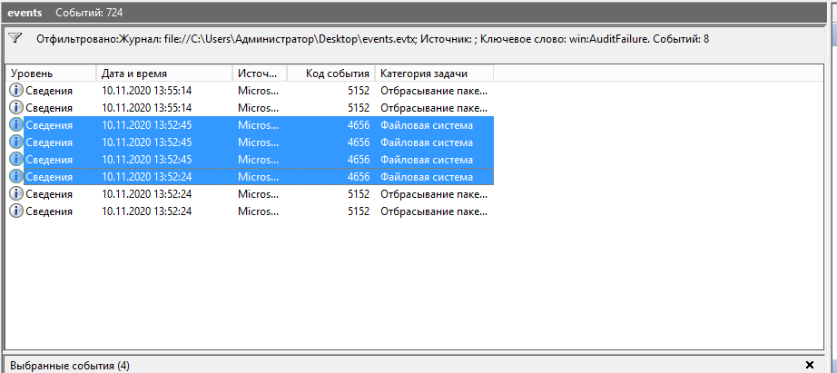
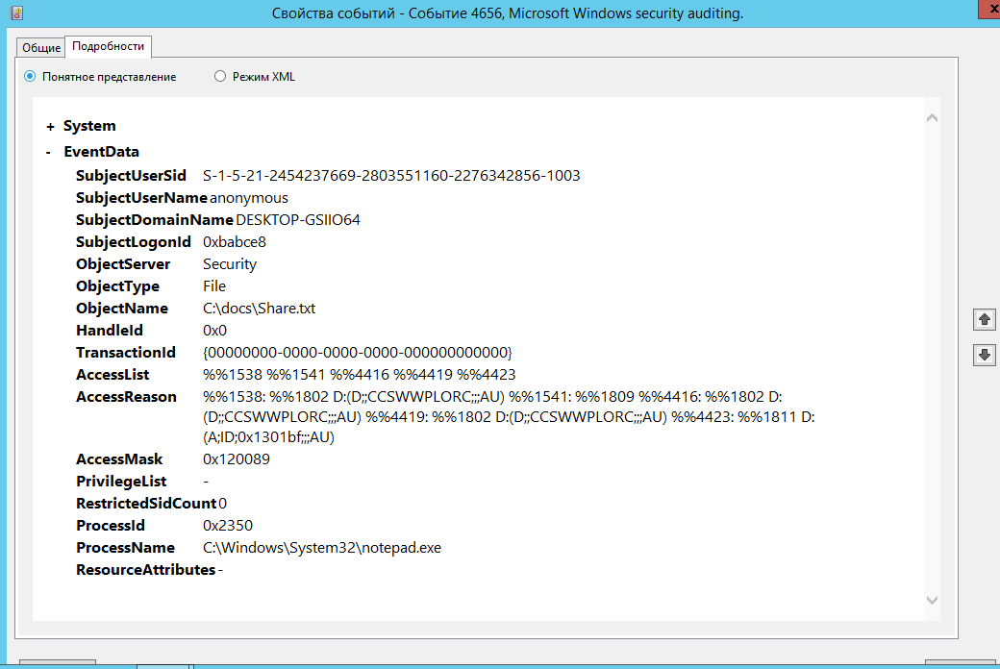
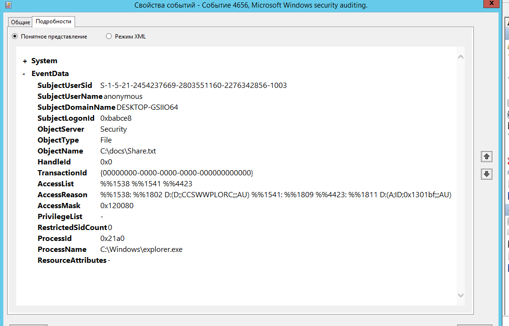
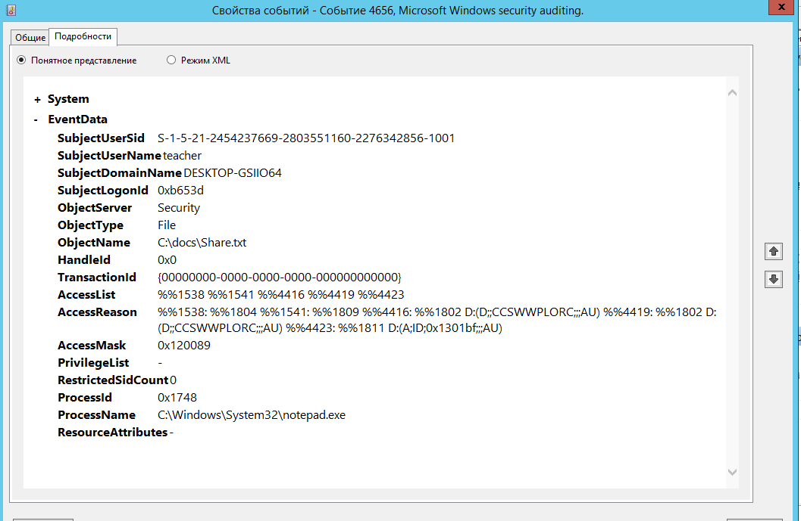
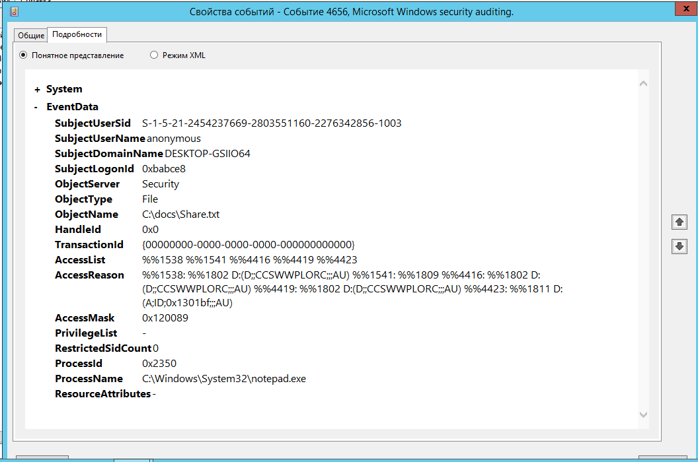

# Домашнее задание к занятию «ОС Windows (часть 2)» - Лунев Федор Владимирович

**1. Для каких пользователей (логины и SID'ы) зарегистрированы события типа Audit Failure (в русскоязычной Windows - Аудит отказа) по доступу к файлу Share.txt?**

Пользователь: `anonymous`, SID: `S-1-5-21-2454237669-2803551160-2276342856-1003`

Пользователь: `teacher`, SID: `S-1-5-21-2454237669-2803551160-2276342856-1001`

**2. Каковы ID событий (Event ID) и время, когда это было зафиксировано (в русскоязычной Windows Код события)?**

Код события (Event ID): `4656`
Всего зафиксировано 4 события. Время:
- 1 событие в 10.11.2020 13:52:24 
- 3 события в 10.11.2020 13:52:45

**3. С помощью каких процессов (приложений) была осуществлена попытка доступа (в русскоязычной Windows Имя процесса)?**

`C:\Windows\System32\notepad.exe`
`C:\Windows\explorer.exe`

---

